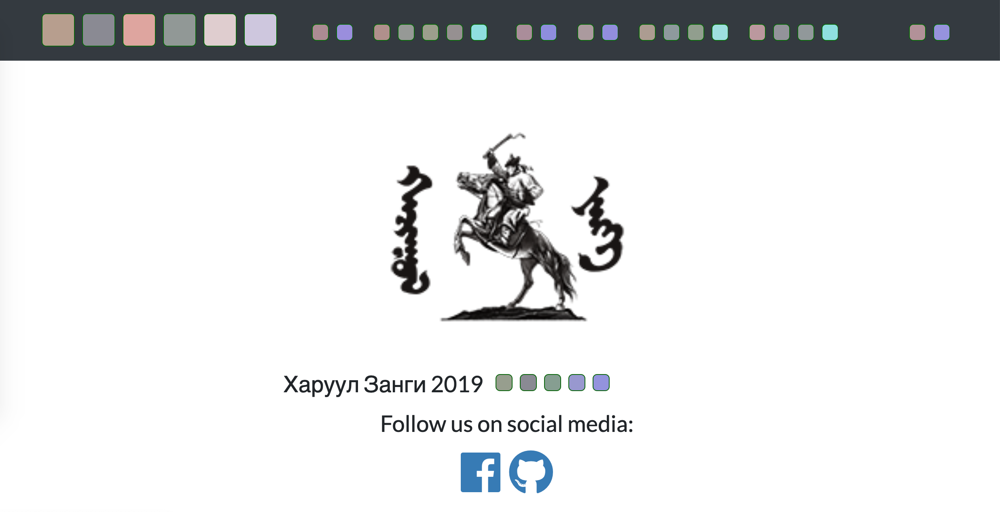
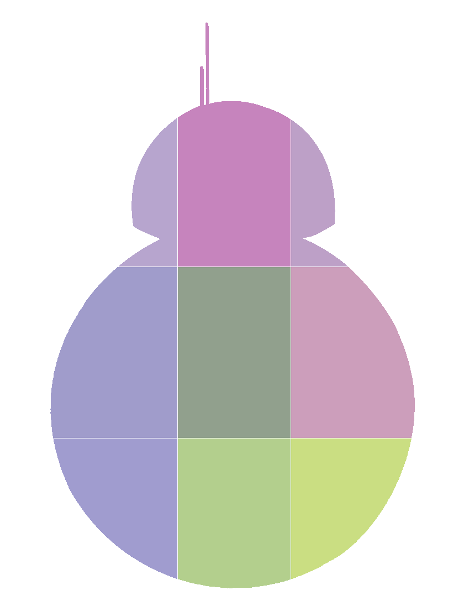
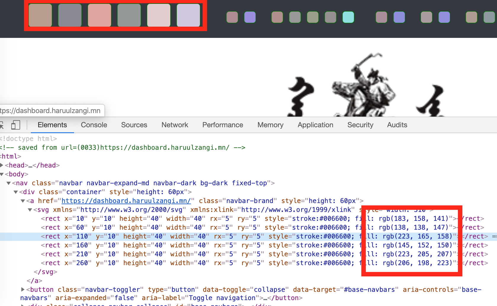

# can you see me 1

Даалгаврын хуудасруу орвол dashboard-тай төстэй дүр харагдана.



Үүнээс гадна хуудасны голд BB-8 харагдана.



Source кодыг нь харвал:



“Haruul Zangi 2019” гэх стринг байрладаг газар өнгө өнгийн дөрвөлжин байхыг харж болно. Мөн адил “Rules”, “Challenges” … гэх мэд navbar ны element-үүд өөрчлөгдсөн байна.

Color-уудынхаа утгуудыг цуглуулаад оролдож үзье.

```py
# screenshot-н дээр байгаа утгууд
bytes = [183, 158, 141] + [138, 138, 147] + [223, 165, 158] + [145, 152, 150] + [223, 205, 207] + [206, 198, 223]
```

“Haruul Zangi 2019” гэх стринг яаж яаваад ийм болсныг ольё .


```
183, 158, 141, 138, 138, 147, 223
H    a    r    u    u    l    зай
```

Хоёр 138 болон 223 гэх тоо олон удаа байх нь шууд орлуулга шифр гэдгийг нь харагдана.

```
H = 72   =>  183
a = 97   =>  141
```

Эндээс шууд 255 аас тоог хасаад орлуулсан зүй тогтол харагдана. Таамагаа шалгаж үзье.

```py
>> print ([chr(255 - _) for _ in bytes ])

['H', 'a', 'r', 'u', 'u', 'l', ' ', 'Z', 'a', 'n', 'g', 'i', ' ', '2', '0', '1', '9', ' ']
```

Одоо нөгөө тэгвэл BB-8 ийн өнгөнүүд дээр энэ хувиргалаа хийе.

```py
# 1bb88.png зүүнээс баруун, дээрээс доошоо өнгөнүүдийн утгуудыг цуглуулвал
bb8 = ["b7a5ce", "c684bd", "bda0c7"] + ["a09ccb", "91a08d", "cc9ebb"] + ["a09ccf", "b3cf8d", "cade82"]

decoded = []

for _ in bb8:
    sep = [_[:2], _[2:4], _[4:6]] # RGB
    sep = [int(x, 16) for x in sep] # hex to decimal
    sep = [chr(255 - x) for x in sep] # 
    decoded += sep

decoded = "".join(decoded)
print ("FLAG: " + decoded)
```

`FLAG: HZ19{BB_8_c4n_r3aD_c0L0r5!}`